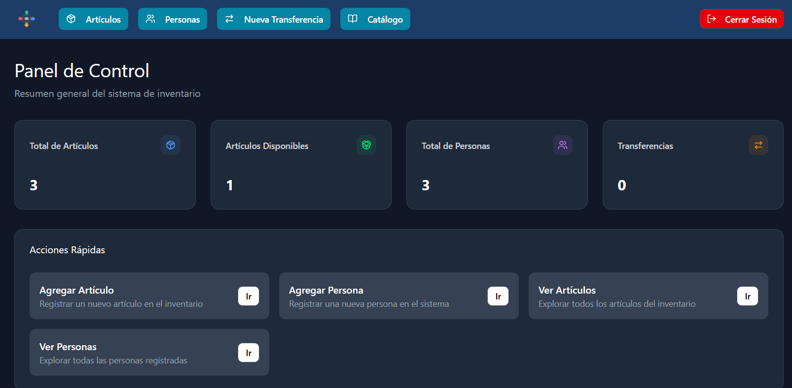
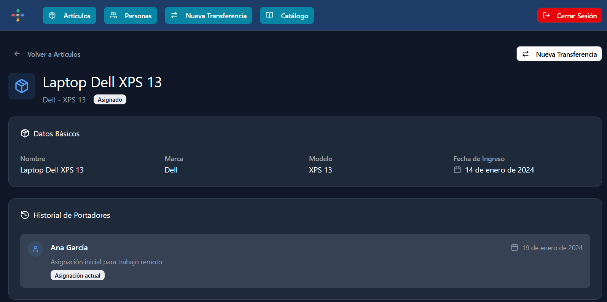
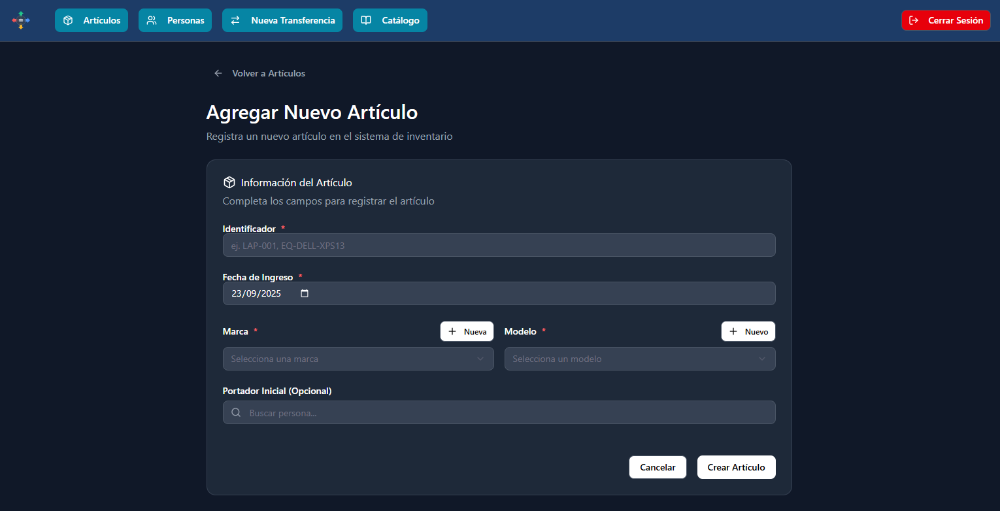
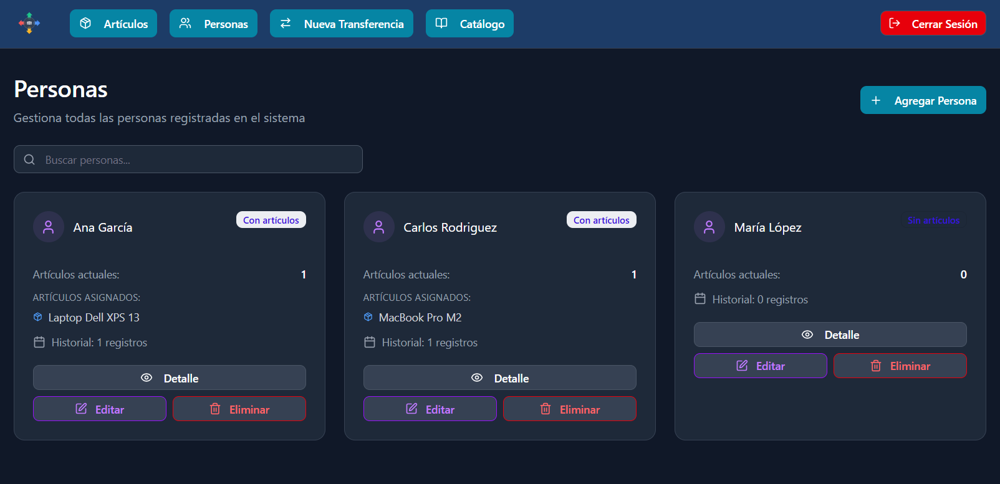
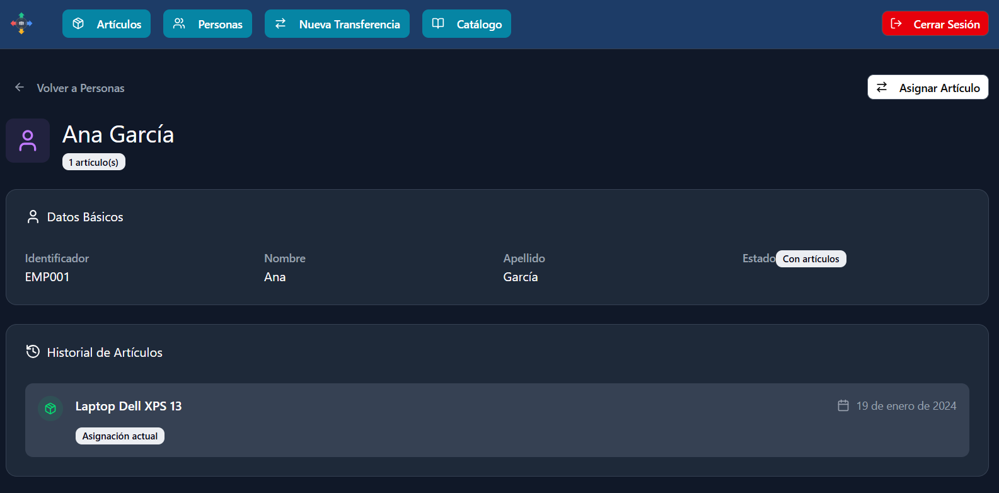
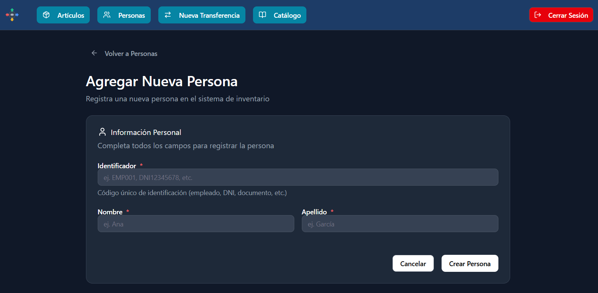
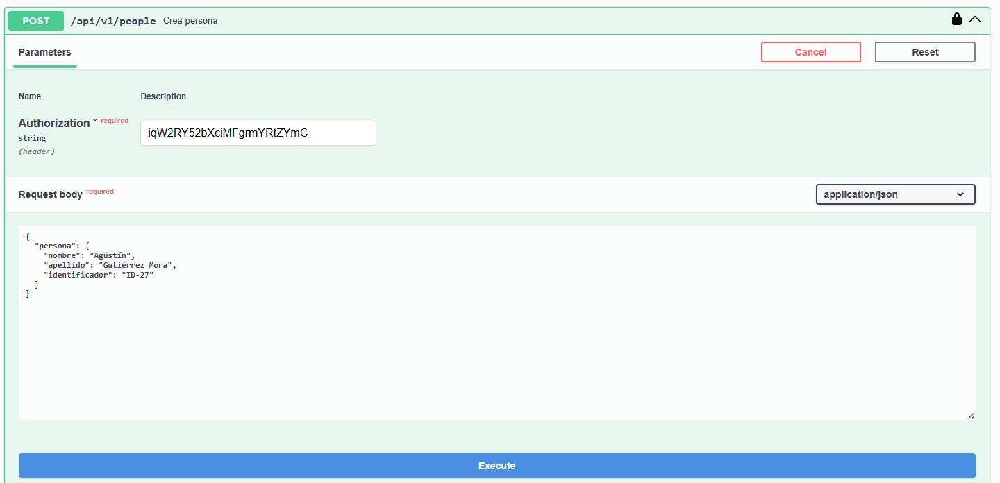
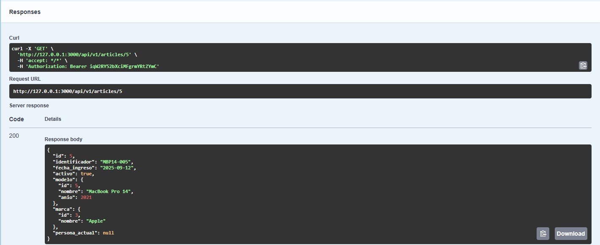

# SisInv — Sistema de Control de Inventario

---

## Índice
- [Introducción](#introducción)
- [Guía de Instalación](#guia-de-instalacion)
- [Decisiones de diseño](#decisiones-de-diseño)
- [Mockups](#mockups)
- [Planificación](#planificacion)
- [API Swagger](#api-swagger)
- [Ejemplos de Request/Response](#api-swagger)
---

## Introducción
**SisInv** permite administrar un inventario de artículos con su **marca**, **modelo**, **portador actual** e **historial de transferencias**.  

La interfaz web consume la **API interna**, lo que facilita separar la capa de presentación de la de servicios.

### Arquitectura y stack
- **Framework:** Ruby on Rails 8 (Ruby 3.2+ recomendado 3.4.x)
- **Frontend:** Hotwire (Turbo + Stimulus) con **importmap**
- **DB:** SQLite 3
- **Auth (web):** sesión con cookie (login)
- **Auth (API):** Bearer Token (JWT-like simple)
- **Docs API:** Swagger (rswag-api, rswag-ui, rswag-specs)

---

## Guía de Instalación
**Requisitos**

-	Ruby 3.3+
-	Bundler 
-	SQLite 3
-	Git

Para levantar el proyecto utilicé WSL (Subsistema de Windows para Linux) con Ubuntu, para eso se deben seguir los siguientes pasos:
> En caso de tener Linux o WSL instalado, pasar al paso (2)

**0. Habilitar WSL + instalar Ubuntu (una sola vez en Windows)**
- Abrir PowerShell como Administrador y ejecutar: `wsl --install -d Ubuntu-24.04`
- Al abrir “Ubuntu”, elegir usuario y contraseña (Linux).

**1. Dependencias base - Preparar Ubuntu**
- `sudo apt update`
- `sudo apt install -y git curl build-essential pkg-config \ libssl-dev zlib1g-dev libreadline-dev libyaml-dev libxml2-dev \ libxslt1-dev libffi-dev libgdbm-dev libncurses5-dev libgmp-dev \ sqlite3 libsqlite3-dev`

**2. Instalar Ruby y Bundler (en caso de no tenerlos)**
- `sudo apt install -y ruby-full`
- `gem install bundler`
- *Comprobar correcta instalación:*
  - `ruby -v`
  - `bundler -v`

**3. Clonar el repositorio**
- `mkdir -p ~/proyectos && cd ~/proyectos` (o carpeta a elección)
- `git clone https://github.com/agugutierrezz/sisinv`
- `cd sisinv`

**4. Instalar dependencias del proyecto y preparar la base de datos**
- `bundle install`
- `bin/rails db:prepare`
#### Importante
Al final de la ejecución de `bin/rails db:prepare`, se imprime en pantalla un **Admin API token**. Este token es necesario para autorizar el uso de la API.  
En caso de no haberlo guardado, ejecutar:
- `bin/rails runner 'puts User.find_by(email_address: "admin@example.com")&.api_token'`

**5. Guardar API token y levantar el servidor**

**Para una sesión**
- `ADMIN_TOKEN=$(bin/rails runner 'print User.find_by(email_address:"admin@example.com")&.api_token')`
- `export API_TOKEN="$ADMIN_TOKEN"`

**Para persistirlo**
- `echo "export API_TOKEN=$ADMIN_TOKEN" >> ~/.bashrc`
- `source ~/.bashrc`

**Levanto el servidor con accesos**
- `bin/rails s`

#### Web (UI)
- Abrir `http://localhost:3000`.
- Iniciar sesión con `admin@example.com - admin12345`.
- Desde la UI podés crear **Marcas**, **Modelos**, **Personas**, **Artículos** y **Transferencias**.

#### API + Swagger
- Abrir `http://localhost:3000/api-docs`.
- Clickear en **Authorize** → pegar el **API token**.
- Probar los endpoints (`GET`/`POST`/`PUT`/`DELETE`).

---

## Decisiones de diseño

**Modelo de Datos**

  
*Figura 1 — Diagrama Entidad-Relación*

**Resumen de relaciones**
- Relación Artículo (1) a (0..1) Persona: la persona está identificada como portador actual, el cual puede ser nulo al momento de crear un artículo.
- Relación Artículo (1) a (1) Modelo y Modelo(\*) a (1) Marca: utilizo modelo y marca como entidad en vez de un atributo para permitir filtros y CRUD de modelos y marcas.
- Relación Artículo (1) a (\*) Transferencia y Transferencia (\*) a (1) Persona: la entidad transferencia actúa como clase intermedia que permite que muchas personas tengan muchos artículos a lo largo del tiempo, permitiendo guardar un historial.

**Reglas de Negocio**
- **Una transferencia abierta por artículo:**
Se garantiza que un artículo tenga a lo sumo una transferencia abierta (sin fecha_fin).

- **Política de borrados y estados:**
Al tener que guardar un historial, no sería correcto permitir borrados físicos o en cascada para todas las entidades, entonces plantee:
  - *Modelo:* permitido si no hay artículos activos asociados, caso contrario no se podrá eliminar el modelo.
  - *Marca:* permitido si no hay modelos asociados, caso contrario no se podrá eliminar la marca.
  - *Persona:* si tiene o tuvo alguna vez un artículo (por ende, una transferencia), se archiva; caso contrario, puede eliminarse físicamente de la base de datos.
  - *Artículo:* si tuvo transferencias, se desactiva y se desasigna persona_actual_id; si nunca tuvo uso, se puede borrar físicamente.

- **Historial de portadores y transferencia inicial:**
Al crear un artículo puede dejarse sin portador actual, el cuál puede asignarse al editar. Cualquiera sea el caso en el que se agregue un portador a un artículo (en la creación o edición), se crea una transferencia inicial, en la cual la fecha de inicio es igual a la fecha al momento de la asignación; con el artículo y la persona seleccionada. Al transferir ese artículo, la fecha de inicio de la siguiente transferencia es igual a la fecha de fin de la anterior.

- **Alta guiada del artículo:**
La entidad artículo es la que cuenta con la mayor cantidad de datos a cargar, por lo que al momento de darle de alta puede ser que se necesite crear en el momento un modelo, una marca y/o un portador. Por lo tanto habrá un atajo que abra un modal y permita crear estas entidades al momento de setear los valores de artículo.

- **Modelado de Marca y Modelo como entidades:**
Permite habilitar reutilización, filtros y CRUD independientes. Modelo pertenece a Marca y un artículo pertenece a un único Modelo. Ambas entidades son utilizadas exclusivamente por Artículo. El CRUD de marcas y modelos se maneja desde una misma interfaz, denominada catálogo.

- **Criterio de UI**
Para las consultas, por defecto, la interfaz gráfica muestra artículos *activos* y personas *no archivadas*.

- **Autenticación con Rails:**
Se implementó un login con el generador de autenticación de Rails 8, con roles de admin/usuario ficticios, la implementación de la aplicación está hecha sobre el usuario administrador.

- **Consumo de API Swagger:**
Se implementó una API que expone las funciones básicas de cada entidad, la cual es consumida por los controladores web, es decir, todas las operaciones de la interfaz gráfica fueron implementadas pegandole a la API, lo cual suma escalabilidad y mantenibilidad. La misma es accesible únicamente mediante un token que se genera al crear un usuario administrador.

- **Manejo de errores y status HTTP:**
La API devuelve códigos estándar: 401 (no autenticado), 404 (no encontrado) y 422 (reglas de negocio: por ej., intentar eliminar un modelo con artículos activos o abrir más de una transferencia). Los errores inesperados se monitorizan para evitar errores 500 (inestabilidad de la API).

---

## Mockups
Los Mockups fueron implementados en Figma mediante su herramienta de Inteligencia Artificial.

  
*Figura 2 — Panel de control*

  
*Figura 3 — Listado de artículos*

  
*Figura 4 — Detalle de artículo*

  
*Figura 5 — Alta/edición de artículo*

  
*Figura 6 — Listado de personas*

  
*Figura 7 — Detalle de persona*

  
*Figura 8 — Alta/edición de persona*

  
*Figura 9 — Alta de transferencia*

**Para ver e interactuar con el flujo completo ingresar a:**  
[Ver Figma](https://www.figma.com/make/0ETxtDJqbvECHFpptQgQDR/Web-Dashboard-Design?node-id=0-1&t=xky1W0gG0WtYcPXm-1)

---

## Planificación

- [x] **1. Definir modelo de datos y crear mockups de referencia.**

- [x] **2. Descargar Ruby on Rails y crear proyecto.**
  - El comando `bin/dev` corre en WSL sin errores.
  - La URL `http://localhost:3000` o `http://127.0.0.1:3000/` muestra la app correctamente.

- [x] **3. Inicializar repositorio en Git.**

- [x] **4. Migrar modelo de datos a SQLite.**
  - Deben existir las tablas: **personas, marcas, modelos, artículos y transferencias** con sus relaciones correspondientes.
  - Deben generarse las tablas **User** y **Session** mediante el comando `bin/rails generate authentication`.
  - El comando `bin/rails db:migrate` corre sin errores.

- [x] **5. Dar de alta las seeds con datos de ejemplo.**
  - El comando `bin/rails db:seed` carga correctamente.
  - Debe haber **+3 personas**, **+5 artículos** y **+2 transferencias**.

- [x] **6. Implementar endpoints para el CRUD y funciones básicas de cada entidad.**
  - En caso de que una persona tenga transferencias, el **“eliminar persona”** se utiliza como **“archivar persona”** para evitar la pérdida de trazabilidad.
  - Deben existir validaciones que eviten cargar datos imprecisos.

- [x] **7. Implementar la interfaz de usuario (UI) desde el inicio hasta las funcionalidades específicas.**
  - Al dar de alta una **persona**, **nombre**, **apellido** e **identificador** son datos obligatorios.
  - Al dar de alta un **artículo**, **identificador**, **fecha de ingreso**, **modelo** y **marca** deben ser datos obligatorios.  
    Al seleccionar **marca** se deben filtrar los **modelos** de esa marca.  
    En caso de que no exista el **modelo**, **marca** o **persona** para elegir, debe haber un **atajo para crear**.
  - Al dar de alta una **transferencia** el **artículo** y la **persona receptora** son datos obligatorios.  
    La **fecha de inicio** de la nueva transferencia, por defecto, debe ser el día actual, el cual también debe ser la **fecha de fin de la anterior** transferencia.  
    Debe poder agregarse una **descripción** opcional.
  - Debe haber **filtros de artículos** por **marca**, **modelo** y **fecha de ingreso** que devuelvan resultados correctos.
  - Debe haber **filtros de persona** por **nombre** y **apellido** que devuelvan resultados correctos.

- [x] **8. Implementar pruebas unitarias.**
  - Las pruebas deben cubrir:
    - **Modelo de datos**
    - **Registro de transferencias**
    - **Validaciones básicas**

- [x] **9. Documentar el proceso** incluyendo instrucciones, decisiones de diseño y generación de seeds.
  - Cualquiera puede levantar el proyecto siguiendo el **README**.

> *Cada ítem representa los criterios de aceptación para marcar como completada una tarea.*

---

## API Swagger

| Método | Ruta                           | Descripción                                  |
| -----: | ------------------------------ | -------------------------------------------- |
|    GET | `/api/v1/articles`             | Lista artículos (filtros: marca, modelo, q…) |
|   POST | `/api/v1/articles`             | Crea artículo                                |
|    GET | `/api/v1/articles/{id}`        | Muestra artículo                             |
|    PUT | `/api/v1/articles/{id}`        | Actualiza artículo                           |
| DELETE | `/api/v1/articles/{id}`        | Elimina/archiva artículo                     |
|    GET | `/api/v1/brands`               | Lista marcas                                 |
|   POST | `/api/v1/brands`               | Crea marca                                   |
|    GET | `/api/v1/brands/{id}`          | Muestra marca                                |
|    PUT | `/api/v1/brands/{id}`          | Actualiza marca                              |
| DELETE | `/api/v1/brands/{id}`          | Elimina marca                                |
|    GET | `/api/v1/models`               | Lista modelos (filtros: marca, q, anio)      |
|   POST | `/api/v1/models`               | Crea modelo                                  |
|    GET | `/api/v1/models/{id}`          | Muestra modelo                               |
|    PUT | `/api/v1/models/{id}`          | Actualiza modelo                             |
| DELETE | `/api/v1/models/{id}`          | Elimina modelo                               |
|    GET | `/api/v1/people`               | Lista personas (paginado / archivado / q)    |
|   POST | `/api/v1/people`               | Crea persona                                 |
|    GET | `/api/v1/people/{id}`          | Muestra persona                              |
|    PUT | `/api/v1/people/{id}`          | Actualiza persona                            |
| DELETE | `/api/v1/people/{id}`          | Elimina/archiva persona                      |
|    GET | `/api/v1/people/{id}/articles` | Historial de artículos por persona           |
|   POST | `/api/v1/transfers`            | Crea transferencia                           |

---

## Ejemplos de Request/Response

### Crear Persona (`POST /api/v1/people`)
**Request**  
  
*Figura 10 — Request: crear persona*

**Response**  
  
*Figura 11 — Response: crear persona*

---

### Editar Marca (`PUT /api/v1/brands/{id}`)
**Request**  
  
*Figura 12 — Request: editar marca*

**Response**  
  
*Figura 13 — Response: editar marca*

---

### Ver Artículo por ID (`GET /api/v1/articles/{id}`)
**Request**  
  
*Figura 14 — Request: ver artículo con ID*

**Response**  
  
*Figura 15 — Response: ver artículo con ID*
